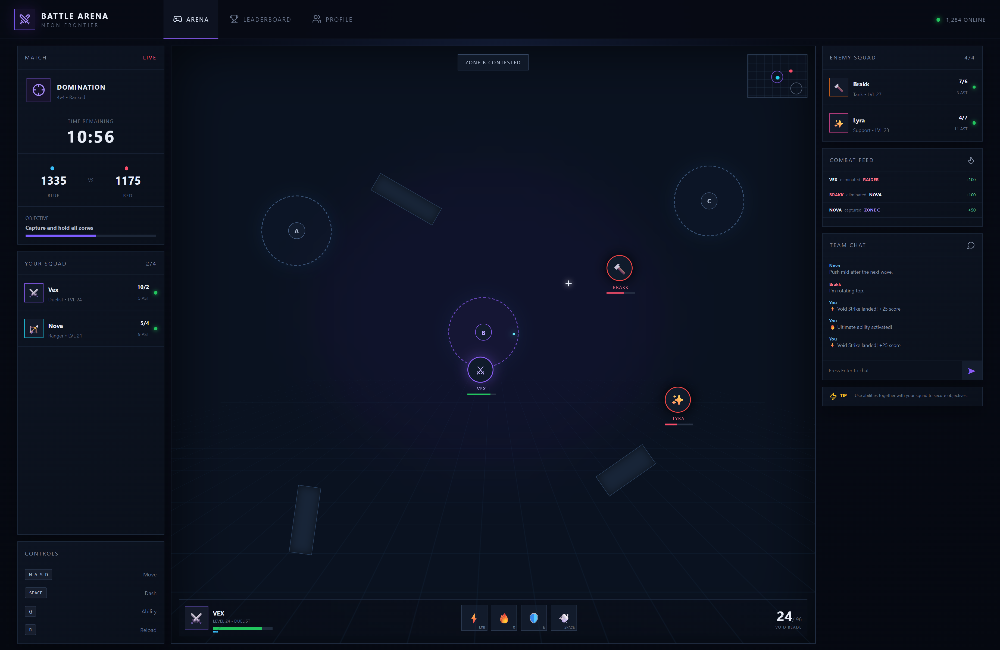

# ⚔️ Multiplayer Battle Arena

A modern **multiplayer-style Battle Arena UI** built with **React.js and Vite**. The project features a neon sci-fi gaming interface with live match statistics, team squads, combat feed, team chat, abilities, minimap, leaderboard, and player profile screens.

> **Note:** This version is a frontend gameplay simulation. Real-time multiplayer functionality can be added using WebSockets/Socket.IO and a backend game server.

## 🛠️ Technologies Used

<p align="left">
  
  
  
  
  
  
  
  
</p>

## 📸 Screenshots




## ✨ Features

### 🎮 Battle Arena

* Neon-themed sci-fi battle arena
* Blue vs Red team system
* 4v4 squad interface
* Live match timer
* Team score tracking
* Capture zones
* Combat feed
* Enemy squad information
* Player health bars
* Energy/mana system
* Ability controls
* Ammunition display
* Interactive minimap
* Target/crosshair indicators

### ⚡ Interactive Gameplay

The interface includes interactive gameplay elements such as:

* Basic attack
* Special ability
* Energy consumption
* Score updates
* Kill count updates
* Combat notifications
* Team chat messages

### 💬 Team Chat

Players can communicate through the built-in team chat interface.

Messages can be entered and submitted directly from the arena.

### 🏆 Leaderboard

The leaderboard provides player rankings based on match performance.

It displays:

* Player ranking
* Kills
* Deaths
* Assists
* Performance points
* Player level
* Character role

### 👤 Player Profile

The profile screen includes:

* Player level
* XP progress
* Wins
* Kill/Death ratio
* Objective percentage
* Player rating
* Character information

### 📱 Responsive Design

The interface is designed to work across:

* Desktop
* Laptop
* Tablet
* Mobile devices

## 🎯 Game Interface

The main arena contains several HUD sections:

```text
┌──────────────────────────────────────────────────────────────┐
│                     BATTLE ARENA                              │
├──────────────┬───────────────────────────────┬───────────────┤
│              │                               │               │
│   MATCH      │                               │    ENEMY      │
│              │                               │    SQUAD      │
│   YOUR       │        BATTLEFIELD            │               │
│   SQUAD      │                               │    COMBAT     │
│              │       Capture Zones           │    FEED       │
│   CONTROLS   │                               │               │
│              │                               │    CHAT       │
│              ├───────────────────────────────┤               │
│              │        PLAYER HUD             │               │
└──────────────┴───────────────────────────────┴───────────────┘
```

## 🗂️ Project Structure

```text
multiplayer-battle-arena/
│
├── public/
│
├── src/
│   ├── main.jsx
│   └── styles.css
│
├── index.html
├── package.json
├── package-lock.json
└── README.md
```

## 🚀 Getting Started

### 1. Clone the repository

```bash
git clone https://github.com/ajinkya029/multiplayer-battle-arena.git
```

### 2. Navigate to the project

```bash
cd multiplayer-battle-arena
```

### 3. Install dependencies

```bash
npm install
```

### 4. Start the development server

```bash
npm run dev
```

Vite will provide a local development URL, usually:

```text
http://localhost:5173
```

### 5. Create a production build

```bash
npm run build
```

### 6. Preview the production build

```bash
npm run preview
```

## 🎮 Controls

| Key       | Action  |
| --------- | ------- |
| `W A S D` | Move    |
| `SPACE`   | Dash    |
| `Q`       | Ability |
| `R`       | Reload  |
| `LMB`     | Attack  |

The controls are currently represented in the frontend interface and can be connected to an actual game engine or multiplayer state system in a future version.

## 🧩 Main Components

### Arena

The central battlefield contains:

* Capture zones
* Players
* Enemies
* Obstacles
* Minimap
* Crosshair
* Combat HUD

### Squad Panel

Displays information about teammates and opponents, including:

* Character
* Role
* Level
* Kills
* Deaths
* Assists
* Alive status

### Combat Feed

Shows important events occurring during the match.

Example:

```text
VEX eliminated RAIDER       +100
BRAKK eliminated NOVA       +100
NOVA captured ZONE C         +50
```

### Ability System

The UI contains several ability slots that can be extended with real gameplay mechanics.

```text
⚡ Attack
🔥 Ultimate
🛡️ Shield
💨 Dash
```

## 🔮 Future Improvements

This project can be extended into a complete real-time multiplayer game by adding:

- Node.js backend
- Socket.IO / WebSocket multiplayer
- Player matchmaking
- Authentication
- Persistent player profiles
- Real-time player movement
- Server-side game state
- Real-time combat synchronization
- Weapon system
- Character selection
- Multiple maps
- Ranked matchmaking
- Match history
- Friends system
- Voice chat
- Game lobby
- Database integration
- Anti-cheat protection

## 🌐 Possible Full-Stack Architecture

A production version could use:

```text
                 ┌─────────────────┐
                 │   React + Vite  │
                 │    Game Client   │
                 └────────┬────────┘
                          │
                    WebSocket
                          │
                 ┌────────▼────────┐
                 │    Node.js      │
                 │   Socket.IO     │
                 │  Game Server    │
                 └───────┬─────────┘
                         │
              ┌──────────┴──────────┐
              │                     │
       ┌──────▼──────┐       ┌──────▼──────┐
       │   MongoDB   │       │    Redis    │
       │   Players   │       │ Game State  │
       └─────────────┘       └─────────────┘
```

## 📦 Dependencies

### React

Used to build the component-based user interface.

### Vite

Used as the development server and build tool.

### Lucide React

Used for interface icons throughout the application.

## 💡 Learning Objectives

This project demonstrates practical frontend development concepts including:

* React components
* React state management
* Event handling
* Conditional rendering
* Dynamic UI updates
* Array manipulation
* Responsive CSS
* CSS animations and effects
* Game HUD design
* Dashboard-style layouts
* Vite project configuration

## 👨‍💻 Author

**Ajinkya Dhatrak**

Github : ```https://github.com/ajinkya029```

## 📄 License

This project is available for educational and personal use.

---

⭐ If you found this project useful, consider giving the repository a star!
